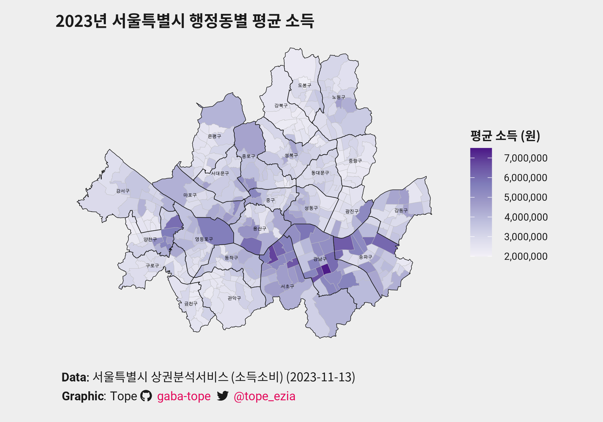

# 서울특별시 행정동별 평균소득 데이터
## date: "**2023-12-23**"

----
[](./girafe_map_int.html),
----

서울특별시의 행정동별 평균 소득을 시각화하였습니다. 

### Dataset
1. 서울시 행정동별 평균 소득 및 소비 데이터셋
    - "서울 열린데이터 광장"에서 제공하는 [서울시 상권분석서비스(소득소비-서울시)](https://data.seoul.go.kr/dataList/OA-22168/S/1/datasetView.do)의 .csv 파일을 다운로드하여 사용함. 
    - 최신수정일자 2023.11.13일자의 데이터
    - License: CC BY
2. 서울시 구역의 도형 데이터셋
    - ["주소기반산업지원서비스"]("https://business.juso.go.kr/")의 "제공하는 주소" - "구역의 도형" - 2022년 11월 자료 선택하여 수령 ("구역의도형_전체분_서울특별시.zip") 후 사용함.
    - "TL_SCCO_GEMD.shp"이 서울시 행정동의 구역의 도형 shape file임. .dbf 파일과 .shx 파일과 동일 directory에 있어야 함을 유의. EPSG가 NULL이었어서, 다음 스크립트로 crs를 EPSG:5179로 지정. 
    ```r
    map_seoul<- sf::st_set_crs(map_seoul, 5179) 
    ```
    - "TL_SCCO_SIG.shp"이 서울시 구의 구역의 도형 shape file임. 마찬가지로 .dbf 파일과 .shx 파일과 동일 directory에 있어야 함. 마찬가지로 EPSG가 NULL이었어서, 다음 스크립트로 crs를 EPSG:5179로 지정. 
    ```r
    map_seoul_gu<- sf::st_set_crs(map_seoul_gu, 5179) 
    ```
3. 서울시 한강의 도형 데이터셋
    - 한강도 그려보려는 시도를 하는 중입니다. 
    - [국토교통부의 하천/용도구역 데이터]("https://www.vworld.kr/dtmk/dtmk_ntads_s002.do?dsId=30441")의 2024년 1월 13일자 파일  
    "LSMD_CONT_UJ201_서울.zip"을 다운로드하여 사용함.
    - "LSMD_CONT_UJ201_11_202401.shp"이 서울시 하천의 도형 shape file임. .dbf 파일과 .shx 파일과 동일 directory에 있어야 함을 유의.
    - 해당 파일의 crs는 EPSG:5186임.
    - License: CC BY-NC-ND

### Data Wrangling:
행정동별 소득 소비에 관한 데이터가 "raw_seoul" 객체입니다. "raw_seoul" 객체 중 "quarter" == 20231 조건을 만족하는 데이터를 "seoul_20231" 객체에 저장하였습니다.<br>

"seoul_20231" 객체는 *"개포3동", "상일제1동", "상일제2동"의 데이터를 포함하지 않고* 있는데, 이는 소득 소비 데이터가 행정동 분리 및 명칭 변경 이전에 작성되었기 때문인 것으로 보입니다.

1. "seoul_20231"상의 "일원2동"은 2022년 12월 23일에 "개포3동"으로 명칭이 변경되었습니다. 이에 따라 "seoul_20231"상의 "dong_name"변수를 "일원2동"에서 "개포3동"으로 변경하고 해당 "dong_code"와 "EMD_CD" 변수 또한 변경하여 "seoul_20231_updated" 객체에 저장하였습니다. 변경된 부분에 관하여 다음의 코드를 보세요.

```r
seoul_20231_updated[seoul_20231_updated$dong_code == 11680740, 17] <- "1168067500" # 일원2동 -> 개포3동 renamed
seoul_20231_updated[seoul_20231_updated$dong_code == 11680740, 3] <-  "개포3동" # 일원2동 -> 개포3동 renamed
```

2. "seoul_20231"상의 "상일동"은 2021년 07월 01일에 "상일제1동"으로 명칭이 변경되었습니다. 이에 따라 "seoul_20231"상의 "dong_name"변수를 "상일동"에서 "상일제1동"으로 변경하고 해당 "dong_code"와 "EMD_CD" 변수 또한 변경하여 "seoul_20231_updated" 객체에 저장하였습니다. 변경된 부분에 관하여 다음의 코드를 보세요. 

```r
seoul_20231_updated[seoul_20231_updated$dong_code == 11740520, 17] <- "1174052500" # 상일동 -> 상일제1동 renamed
seoul_20231_updated[seoul_20231_updated$dong_code == 11740520, 3] <- "상일제1동" # 상일동 -> 상일제1동 renamed
```

3."seoul_20231"상의 "강일동"의 남쪽 지역은 2021년 07월 01일에 "상일제2동"으로 분리되었습니다. 이에 따라 "seoul_20231_updated" 객체에 "dong_name"을 "상일제2동"으로, 해당하는 "dong_code"와 "EMD_CD"를 넣어 새로운 행을 추가하였습니다. 이때 "상일제2동"의 소득-지출 데이터는 "강일동"의 데이터를 복사하여 그대로 붙여넣었음을 참고해주세요. 변경된 부분에 관하여 다음의 코드를 보세요. 

```r
seoul_20231_updated[nrow(seoul_20231_updated)+1, ] <- NA # New empty row added
seoul_20231_updated[nrow(seoul_20231_updated), 1:3] <- list(20231, 11740526,"상일제2동") # 상일제2동 row added (South region of 강일동 became 상일제2동)
seoul_20231_updated[nrow(seoul_20231_updated), 4:16] <- seoul_20231_updated[283, 4:16] # 상일제2동 data is the same as 강일동. 
seoul_20231_updated[nrow(seoul_20231_updated), 17] <- "1174052600"
```

### Plotting
1. {ggplot2}의 geom_sf object을 사용하여 지도를 그림. 
2. Interactive plot은 {ggiraph}의 geom_sf_interactive() object을 {ggplot2}와 사용하여 그림.